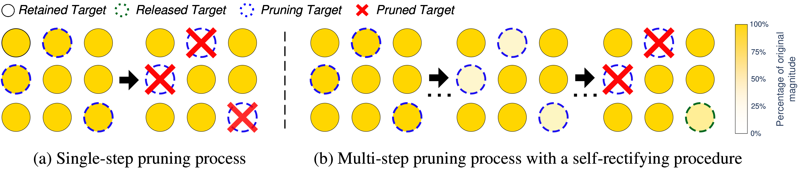
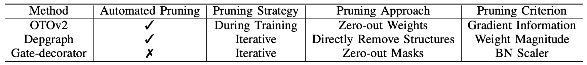

# Decay Pruning Method (DPM): Smooth Pruning With a Self-Rectifying Procedure

 [](#) [](#) [](#) <a href="https://arxiv.org/abs/2406.03879" target="_blank"></a>


## Make Structured Pruning Methods Smooth and Adaptive!

**D**ecay **P**runing **M**ethod (**DPM**) is a novel ***smooth*** and ***dynamic*** pruning approach, that can be seemingly integrated with various existing structured pruning methods, providing significant improvement. 
Unlike traditional single-step pruning approaches that remove or zero out redundant structures abruptly, DPM employs a multi-step, smooth process that gradually decays these structures to zero, for better information retention. Additionally, DPM incorporates a gradient-based self-rectifying procedure that identifies and corrects sub-optimal pruning decisions during the decay, ensuring more precise and adaptive pruning decisions.

## How DPM works.


Our **DPM** contains two procedures:


  * ***Smooth Pruning (SP):*** *SP* is a multi-step pruning process that gradually decays the weights of redundant structures to zero over N steps while maintaining continuous optimization. This approach minimizes drastic network changes and enhances information retention during pruning.
  * ***Self-Rectifying (SR):*** *SR* employs a gradient-driven approach to assess the resistance of decaying structures, effectively correcting sub-optimal pruning decisions and enabling more adaptive and optimal pruning decisions.z
  
More technical details of DPM are available at our preprint paper: [**Decay Pruning Method: Smooth Pruning With a Self-Rectifying Procedure**](https://arxiv.org/abs/2406.03879)   

## TODO List.
- [ ] Add integration examples and tutorials for [Depgraph](https://github.com/VainF/Torch-Pruning) and [gate-decorator](https://github.com/youzhonghui/gate-decorator-pruning). 
- [ ] Make tutorials and user-friendly codes for DPM integration.

## Experimental Results.

We verified the effectiveness and generalizability of DPM by integrating it into three pruning frameworks: the newly proposed [OTOv2](https://github.com/tianyic/only_train_once_personal_footprint/tree/otov2_legacy_backup) and  [Depgraph](https://github.com/VainF/Torch-Pruning), as well as the classic [Gate-Decorator](https://github.com/youzhonghui/gate-decorator-pruning), each within their original configurations. *All codes for these examples of integration will be uploaded soon!*


### 1, Integrating DPM with OTOv2.
####  Benchmark: VGG16-BN / CIFAR-10
| Method       | FLOPs                       | Params                | Top-1 Acc.                  |
| :----------- | :-------------------------- | :-------------------- | :-------------------------- |
| Baseline     | 100%                        | 100%                  | 93.2%                       |
| EC [[1]](#1)          | 65.8%                       | 37.0%                 | 93.1%                       |
| Hinge [[2]](#2)       | 60.9%                       | 20.0%                 | 93.6%                       |
| SCP [[3]](#3)          | 33.8%                       | 7.0%                  | **93.8%**                   |
|              |                             |                       |                             |
| OTOv2 [[4]](#4)       | 26.5%                       | **4.8%**              | 93.4%                       |
| *+SP* (Ours) | 26.4% <sup>-0.1%↓</sup>     | **4.8%** <sup>-</sup> | 93.6% <sup>+0.2%↑</sup>     |
| *+SR* (Ours) | **25.8%** <sup>-0.7%↓</sup> | **4.8%** <sup>-</sup> | **93.8%** <sup>+0.4%↑</sup> |

**Notations:**

  * **Note 1:** We use *’+SP’* to denote the exclusive use of *Smooth Pruning*, and *’+SR’* when both *Smooth Pruning* and *Self-Rectifying* are applied. 
  * **Note 2:** The best pruning results are highlighted in bold.
  * **Note 3:** The enhancement from DPM are presented with superscript.

In this benchmark, DPM notably increased the accuracy of OTOv2 by **0.4%** and reduced the FLOPs by **0.7%**, achieving the highest performance compared to OTOv2 and other leading methods, including SCP.
### 2, Integrating DPM with Depgraph.
####  Benchmark: ResNet-56 / CIFAR-10

| Method              | FLOPs                     | Params                        | Top-1 Acc.                    |
| :------------------ | :------------------------ | :---------------------------- | :---------------------------- |
| Baseline            | 100%                      | 100%                          | 93.53%                        |
| Hinge [[2]](#2)                | 50.0%                     | 48.73%                        | 93.69%             |
| SCP [[3]](#3)                 | 51.5%                     | 48.47%                        | 93.23%              |
| ResRep [[5]](#5)               | 47.2%                     | —                             | 93.71%                        |
| SANP [[6]](#6)                 | 48.0%                     | —                             | 93.81%                        |
| APIB [[7]](#7)                 | 46.0%                     | 50.0%                         | 93.92%                        |
| SFP [[8]](#8)                  | 47.4%                     | —                             | 93.66%                        |
| ASFP [[9]](#9)                 | 47.4%                     | —                             | 93.32%                        |
|                     |                           |                               |                               |
| Depgraph [[10]](#10)         | 46.86%                    | 52.9%                         | 93.84%                        |
| *+SP* (Ours)        | 46.32% <sup>-0.1%↓</sup>  | 49.69% <sup>-3.21%↓</sup>     | 93.96% <sup>+0.12%↑</sup>     |
| *+SR* (Ours)        | 45.80% <sup>-1.06%↓</sup> | **47.22%** <sup>-5.68%↓</sup> | **94.13%** <sup>+0.29%↑</sup> |
|                     |                           |                               |      
| Depgraph w/o SL [[10]](#10)| 47.2%                     | 69.7%                         | 93.32%                        |
| *+SP* (Ours)        | 46.7% <sup>-0.5%↓</sup>   | 68.1% <sup>-1.6%↓</sup>       | 93.62% <sup>+0.3%↑</sup>      |
| *+SR* (Ours)        | 47.1% <sup>-0.1%↓</sup>   | 65.73% <sup>-2.4%↓</sup>      | 93.71% <sup>+0.39%↑</sup>     |

**Notations:**

  * **Note 1:**  For cases where results are not reported from literature, we mark them as ‘-’. 
  * **Note 2:** "w/o SL" = "without sparse learning".

DPM significantly enhances accuracy across both configurations, **reducing parameters by over 4%** compared to the original Depgraph. Specifically, with the Group Pruner combined with Sparse Learning, DPM achieves **a state-of-the-art accuracy of 94.13%, while further reducing FLOPs by 1% and parameters by 5.7%**. This performance significantly surpasses the state-of-the-art method APIB by 0.2% in accuracy, with even higher model efficiency. 

### 3, Integrating DPM with Gate-Decorator.
####  Benchmark: VGG16 / CIFAR-10

| Method       | FLOPs                              | Params                             | Top-1 Acc.                        |
| ------------ | ---------------------------------- | ---------------------------------- | --------------------------------- |
| Gate-Decorator [[11]](#11)| 9.86%                              | 1.98%                              | 91.50%                            |
| *+SP* (Ours) | 9.88% <sup>+0.02%↑</sup>           | 1.97% <sup>-0.01%↓</sup>           | 91.58% <sup>+0.08%↑</sup>         |
| *+SR* (Ours) | **9.79%** <sup>-0.07%↓</sup>       | **1.95%** <sup>-0.03%↓</sup>       | **91.74%** <sup>+0.24%↑</sup>     |

DPM improves accuracy by 0.24%, reduces FLOPs by 0.07%, and decreases parameters by 0.03%. 

## Citation.

```
@misc{yang2024decaypruningmethodsmooth,
      title={Decay Pruning Method: Smooth Pruning With a Self-Rectifying Procedure}, 
      author={Minghao Yang and Linlin Gao and Pengyuan Li and Wenbo Li and Yihong Dong and Zhiying Cui},
      year={2024},
      eprint={2406.03879},
      archivePrefix={arXiv},
      primaryClass={cs.LG},
      url={https://arxiv.org/abs/2406.03879}, 
}
```


## References.

<a id="1">[1]</a> H. Li, A. Kadav, I. Durdanovic, H. Samet, and H. P. Graf, “Pruning filters for efficient convnets,” in Proc. Int. Conf. Learn. Represent., 2017. 

<a id="2">[2]</a> Y. Li, S. Gu, C. Mayer, L. V. Gool, and R. Timofte, “Group sparsity: The hinge between filter pruning and decomposition for network com-pression,” in Proc. IEEE Conf. Comput. Vis. Pattern Recog., 2020, pp. 8015–8024.

<a id="3">[3]</a> M. Kang and B. Han, “Operation-aware soft channel pruning using differentiable masks,” in Proc. Int. Conf. Mach. Learn., 2020, pp. 5122– 5131.

<a id="4">[4]</a> T. Chen, L. Liang, T. Ding, Z. Zhu, and I. Zharkov, “Otov2: Automatic, generic, user-friendly,” in Proc. Int. Conf. Learn. Represent., 2023. 

<a id="5">[5]</a> X. Ding, T. Hao, J. Tan, J. Liu, J. Han, Y. Guo, and G. Ding, “Resrep: Lossless cnn pruning via decoupling remembering and forgetting,” in Proc. IEEE Int. Conf. Comput. Vis., 2020, pp. 4490–4500. 

<a id="6">[6]</a> S. Gao, Z. Zhang, Y. Zhang, F. Huang, and H. Huang, “Structural alignment for network pruning through partial regularization,” in Proc. IEEE Int. Conf. Comput. Vis., 2023, pp. 17 356–17 366.

<a id="7">[7]</a> S. Guo, L. Zhang, X. Zheng, Y. Wang, Y. Li, F. Chao, C. Wu, S. Zhang, and R. Ji, “Automatic network pruning via hilbert-schmidt independence criterion lasso under information bottleneck principle,” in Proc. IEEE Int. Conf. Comput. Vis., 2023, pp. 17 412–17 423.

<a id="8">[8]</a> Y. He, G. Kang, X. Dong, Y. Fu, and Y. Yang, “Soft filter pruning for accelerating deep convolutional neural networks,” in Proc. Int. Joint Conf. Artif. Intell., 2018.

<a id="9">[9]</a> Y. He, X. Dong, G. Kang, Y. Fu, C. Yan, and Y. Yang, “Asymptotic soft filter pruning for deep convolutional neural networks,” arXiv preprint arXiv:1808.07471, 2019.

<a id="10">[10]</a> G. Fang, X. Ma, M. Song, M. B. Mi, and X. Wang, “Depgraph: Towards any structural pruning,” in Proc. IEEE Conf. Comput. Vis. Pattern Recog., 2023, pp. 16 091–16 101.

<a id="11">[11]</a> Z. You, K. Yan, J. Ye, M. Ma, and P. Wang, “Gate decorator: Global filter pruning method for accelerating deep convolutional neural networks,” in Proc. Adv. Neural Inf. Process. Syst., 2019, pp. 2130–2141.


